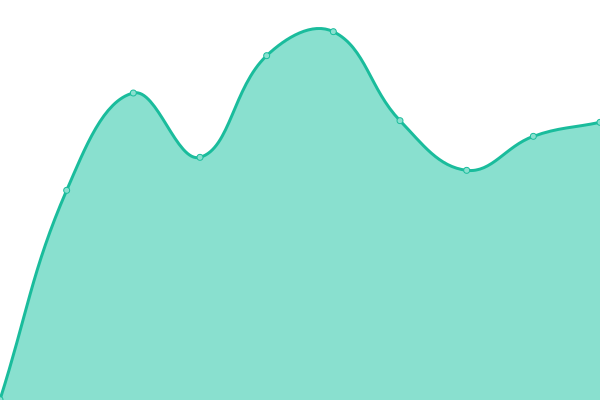
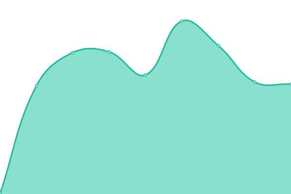
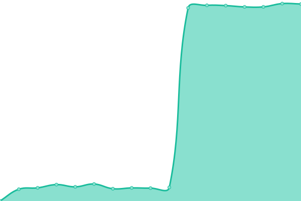

# [📈 Live Status](https://status.arash-hatami.ir): <!--live status--> **🟧 Partial outage**

This repository contains the open-source uptime monitor and status page for [Arash Hatami](https://arash-hatami.ir).

<!--start: status pages-->
<!-- This summary is generated by Upptime (https://github.com/upptime/upptime) -->
<!-- Do not edit this manually, your changes will be overwritten -->
<!-- prettier-ignore -->
| URL | Status | History | Response Time | Uptime |
| --- | ------ | ------- | ------------- | ------ |
|  [Main Website](https://arash-hatami.ir) | 🟩 Up | [main-website.yml](https://github.com/hatamiarash7/MyWebSite_Status/commits/HEAD/history/main-website.yml) | 

 1098ms
     
 | 

<a href="https://status.arash-hatami.ir/history/main-website">100.00%</a>
    

|  [Main Website - CGI](https://arash-hatami.ir/cdn-cgi/ping) | 🟩 Up | [main-website-cgi.yml](https://github.com/hatamiarash7/MyWebSite_Status/commits/HEAD/history/main-website-cgi.yml) | 

 131ms
     
 | 

<a href="https://status.arash-hatami.ir/history/main-website-cgi">100.00%</a>
    

|  [Portfolio](https://portfolio.arash-hatami.ir) | 🟩 Up | [portfolio.yml](https://github.com/hatamiarash7/MyWebSite_Status/commits/HEAD/history/portfolio.yml) | 

 773ms
     
 | 

<a href="https://status.arash-hatami.ir/history/portfolio">100.00%</a>
    

|  [Status Page](https://status.arash-hatami.ir) | 🟩 Up | [status-page.yml](https://github.com/hatamiarash7/MyWebSite_Status/commits/HEAD/history/status-page.yml) | 

 705ms
     
 | 

<a href="https://status.arash-hatami.ir/history/status-page">100.00%</a>
    

|  [Analytics Server](https://analytics.arash-hatami.ir) | 🟩 Up | [analytics-server.yml](https://github.com/hatamiarash7/MyWebSite_Status/commits/HEAD/history/analytics-server.yml) | 

 5742ms
     
 | 

<a href="https://status.arash-hatami.ir/history/analytics-server">90.94%</a>
    

|  [Comment Server](https://nikas.arash-hatami.ir) | 🟩 Up | [comment-server.yml](https://github.com/hatamiarash7/MyWebSite_Status/commits/HEAD/history/comment-server.yml) | 

 2441ms
     
 | 

<a href="https://status.arash-hatami.ir/history/comment-server">98.85%</a>
    

|  [Git Server](https://git.arash-hatami.ir) | 🟥 Down | [git-server.yml](https://github.com/hatamiarash7/MyWebSite_Status/commits/HEAD/history/git-server.yml) | 

 6388ms
     
 | 

<a href="https://status.arash-hatami.ir/history/git-server">90.92%</a>
    

|  [Code Guide](https://cg.arash-hatami.ir) | 🟩 Up | [code-guide.yml](https://github.com/hatamiarash7/MyWebSite_Status/commits/HEAD/history/code-guide.yml) | 

 1047ms
     
 | 

<a href="https://status.arash-hatami.ir/history/code-guide">0.00%</a>
    

|  [Nikas](https://nikasproject.ir) | 🟩 Up | [nikas.yml](https://github.com/hatamiarash7/MyWebSite_Status/commits/HEAD/history/nikas.yml) | 

 1352ms
     
 | 

<a href="https://status.arash-hatami.ir/history/nikas">100.00%</a>
    

|  [Periodic Table](https://periodic.arash-hatami.ir) | 🟩 Up | [periodic-table.yml](https://github.com/hatamiarash7/MyWebSite_Status/commits/HEAD/history/periodic-table.yml) | 

 1226ms
     
 | 

<a href="https://status.arash-hatami.ir/history/periodic-table">0.00%</a>
    

|  [Audio Visualization](https://audiovisualization.arash-hatami.ir) | 🟩 Up | [audio-visualization.yml](https://github.com/hatamiarash7/MyWebSite_Status/commits/HEAD/history/audio-visualization.yml) | 

 629ms
     
 | 

<a href="https://status.arash-hatami.ir/history/audio-visualization">0.00%</a>
    

<!--end: status pages-->

[**Visit our status website →**](https://status.arash-hatami.ir)

## 📄 License

- Code: [MIT](./LICENSE) © [Arash Hatami](https://arash-hatami.ir)
- Data in the `./history` directory: [Open Database License](https://opendatacommons.org/licenses/odbl/1-0/)
